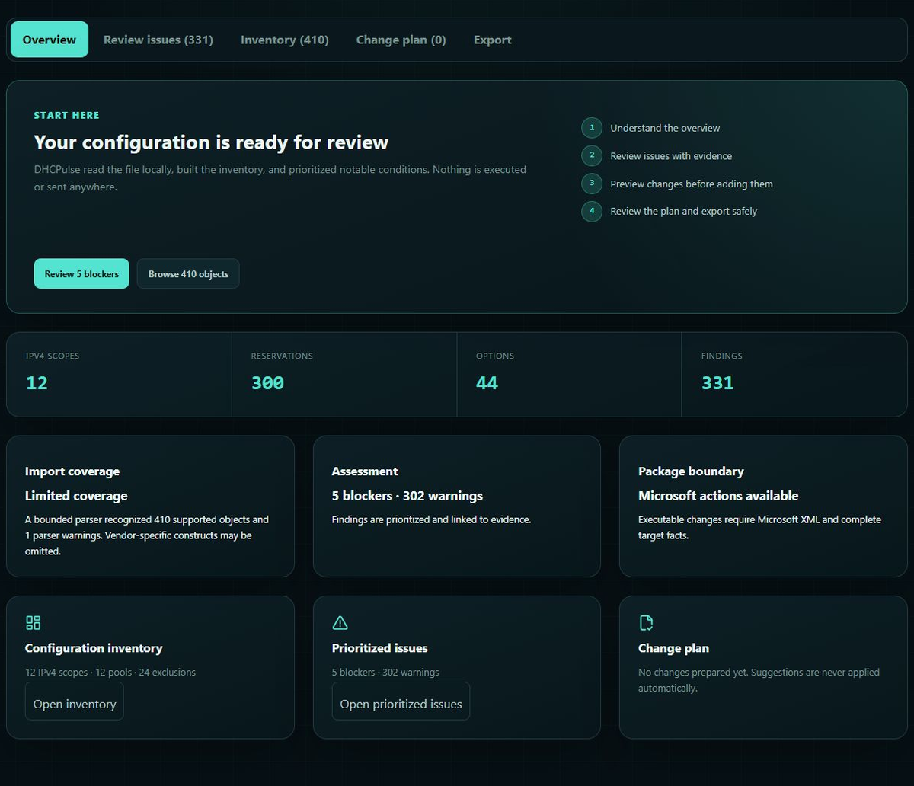
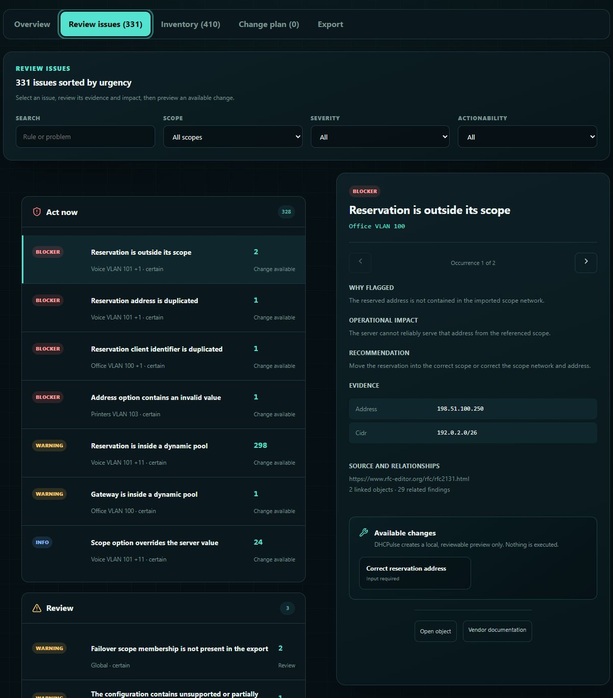
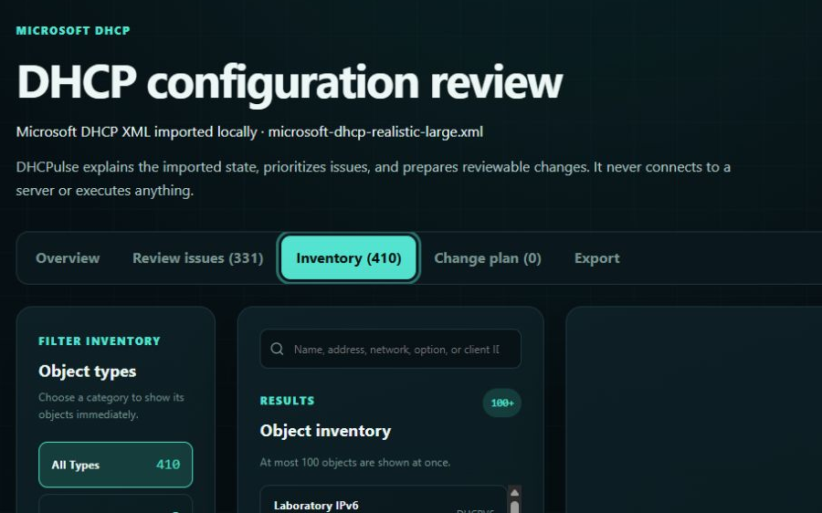

<p align="center">
  
</p>

<h1 align="center">DHCPulse</h1>

<p align="center">
  Turn DHCP configuration exports into a searchable inventory, prioritized review queue, validated change plan, and guarded Microsoft PowerShell package.
</p>

<p align="center">
  Local-first. No backend. No configuration uploads. No server connection.
</p>

<p align="center">
  <a href="https://github.com/bifrost0x/dhcpulse/actions/workflows/ci.yml"></a>
  <a href="https://github.com/bifrost0x/dhcpulse/actions/workflows/container-security.yml"></a>
  <a href="https://github.com/bifrost0x/dhcpulse/actions/workflows/codeql.yml"></a>
  <a href="https://github.com/bifrost0x/dhcpulse/releases/latest"></a>
  <a href="LICENSE"></a>
</p>



## Why DHCPulse exists

DHCP exports are useful backups, but they are difficult to review as an estate. DHCPulse turns supported exports into an operational workspace that answers four practical questions:

1. **What is configured?** Search scopes, pools, exclusions, reservations, options, policies, relays, failover relationships, and DHCPv6 objects.
2. **What deserves attention?** Review grouped findings with evidence, impact, recommendations, confidence, and affected objects.
3. **What would a change do?** Preview allow-listed changes against the complete imported state before they enter the plan.
4. **How can the change be reviewed safely?** Generate separate Preflight, Apply, Verify, and Rollback scripts plus a change record and checksum manifest.

DHCPulse does not connect to a DHCP server, execute scripts, scan a network, provide DHCP service, or replace IPAM/DDI. Kea, ISC dhcpd, and dnsmasq imports are analysis-only. Guarded change packages are currently available for supported Microsoft DHCP XML imports.

## Try the complete workflow with synthetic data

```bash
docker compose pull
docker compose up -d --wait
```

Open **http://localhost:8080/** and select **Open Microsoft example**. The bundled example contains 12 IPv4 scopes, 3 IPv6 scopes, 300 reservations, options, exclusions, policies, and failover relationships. Every address, name, and identifier is synthetic.

You can explore the complete application without using a production export:

1. Confirm import coverage and estate size in **Overview**.
2. Open **Review issues** and inspect evidence for a blocker or warning.
3. Use **Inventory** to search objects and relationships.
4. Preview a supported change and add it to **Change plan**.
5. Review package readiness in **Export**.

The [Operator guide](docs/operator-guide.md) walks through each screen with screenshots and explains what the administrator should verify.

## The admin workflow

| Stage | Administrator action | DHCPulse output |
| --- | --- | --- |
| 1. Import | Select a supported export up to 2 MiB | Vendor detection, normalized objects, provenance, and coverage warnings |
| 2. Understand | Review the overview and inventory | Searchable estate model with bounded rendering |
| 3. Prioritize | Filter issues by scope, severity, and actionability | Evidence-backed review queue with operational context |
| 4. Plan | Preview supported changes before adding them | Validated before/after state and target risk |
| 5. Export | Acknowledge warnings and generate the package | Preflight, Apply, Verify, Rollback, change record, change set, and SHA-256 manifest |

### Prioritized issues



### Searchable inventory



## Supported inputs

| Source | Input | Analysis | Guarded changes |
| --- | --- | --- | --- |
| Microsoft DHCP Server | XML from `Export-DhcpServer` | Yes | Supported allow-listed operations |
| Kea DHCP | JSON configuration | Yes | Analysis only |
| ISC DHCP | `dhcpd.conf` | Yes | Analysis only |
| dnsmasq | DHCP directives | Yes | Analysis only |

Every adapter intentionally implements a bounded subset. Inputs are limited to 2 MiB, structural complexity is bounded, includes are not executed, and unsupported syntax can be omitted with parser warnings. A clean findings list does not prove that every vendor-specific construct was understood. See [Configuration imports](docs/configuration-imports.md).

## Create a Microsoft DHCP export

Run Windows PowerShell with the DHCP Server module and permission to read the target configuration:

```powershell
Import-Module DhcpServer
$ExportPath = Join-Path $env:TEMP 'dhcpulse-export.xml'
Export-DhcpServer -ComputerName $env:COMPUTERNAME -File $ExportPath -Force
$ExportPath
```

Do not add `-Leases`; lease data is not required by the configuration workspace and can make the file substantially larger. Protect or delete the export after use because it can contain infrastructure names, addresses, and client identifiers.

The application contains this guide beside the file picker. More export and vendor guidance is available in [Getting started](docs/getting-started.md).

## Install

### Docker Compose

The default Compose file pulls the official GHCR image. It does not build the checkout locally.

```bash
git clone https://github.com/bifrost0x/dhcpulse.git
cd dhcpulse
docker compose pull
docker compose up -d --wait
```

Open **http://localhost:8080/**. To use a different host port:

```bash
DHCPULSE_PORT=9080 docker compose up -d --wait
```

For controlled environments, replace `latest` in `compose.yaml` with a release tag or immutable image digest.

### Portainer

1. Open **Stacks** and select **Add stack**.
2. Choose **Git repository**.
3. Set the repository URL to `https://github.com/bifrost0x/dhcpulse.git`.
4. Set the Compose path to `compose.yaml`.
5. Optionally define `DHCPULSE_PORT` as an environment variable.
6. Deploy the stack and wait for the container health check.

The stack pulls `ghcr.io/bifrost0x/dhcpulse:latest`, runs without root privileges, uses a read-only root filesystem, drops Linux capabilities, and publishes the application on the configured host port.

### npm

Use a Node.js version from the supported engine range in `package.json`.

```bash
git clone https://github.com/bifrost0x/dhcpulse.git
cd dhcpulse
npm ci
npm run dev
```

Open **http://localhost:5173/**. The development server prints local and trusted-network URLs. For a production-like local preview:

```bash
npm start
```

Then open **http://localhost:4173/**. Docker remains the recommended deployment path.

## Privacy and security boundary

Configuration data stays in JavaScript memory in the current browser tab. DHCPulse implements no file upload, account, application backend, database, cookies, local storage, IndexedDB, service worker cache, analytics, telemetry, or application API calls. Production builds ship with a Content Security Policy that blocks application network connections through `connect-src 'none'`.

Downloads are created locally from in-memory `Blob` objects. Generated Microsoft change packages intentionally contain the operational values needed for review and execution, so treat them like the source export.

Read [PRIVACY.md](PRIVACY.md), [SECURITY.md](SECURITY.md), and [Microsoft change packages](docs/microsoft-change-packages.md) before using production data.

## Specialist utilities

The configuration workspace is the primary workflow. Separate tools remain available for focused tasks:

- scope capacity and runway;
- lease transition timing;
- DHCP option encoding and validation;
- PXE architecture checks;
- failover design;
- DHCPv6 readiness;
- diagnostics and security review;
- configuration analysis and semantic comparison.

These utilities are calculators and bounded analyzers. They do not inspect a live environment.

## Verification

```bash
npm ci
npm run check:repo
npm run audit:dependencies
npm run lint
npm run typecheck
npm run test:ci
npm run build
```

CI enforces coverage, dependency review, CodeQL, secret scanning, container scanning, immutable workflow references, and repository hygiene. The production build verifier checks the effective CSP and rejects compiled network primitives.

Tagged releases include static archives, SHA-256 checksums, a CycloneDX SBOM, GitHub artifact attestations, and native `linux/amd64` and `linux/arm64` container images. See [Release verification](docs/release-verification.md).

## Documentation

- [Operator guide](docs/operator-guide.md)
- [Getting started](docs/getting-started.md)
- [Configuration imports](docs/configuration-imports.md)
- [Microsoft change packages](docs/microsoft-change-packages.md)
- [Deployment](docs/deployment.md)
- [Release verification](docs/release-verification.md)
- [Maintainer release procedure](docs/maintainers/releasing.md)
- [Architecture](docs/architecture/initial-release.md)
- [Privacy](PRIVACY.md)
- [Security policy](SECURITY.md)
- [Support](SUPPORT.md)
- [Contributing](CONTRIBUTING.md)
- [Changelog](CHANGELOG.md)

## Contributing

Focused, evidence-backed contributions are welcome. Use synthetic data, preserve the browser-only privacy boundary, and add behavioral tests for domain changes. Read [CONTRIBUTING.md](CONTRIBUTING.md) and [CODE_OF_CONDUCT.md](CODE_OF_CONDUCT.md) before opening a contribution.

## License

DHCPulse is available under the [MIT License](LICENSE).
